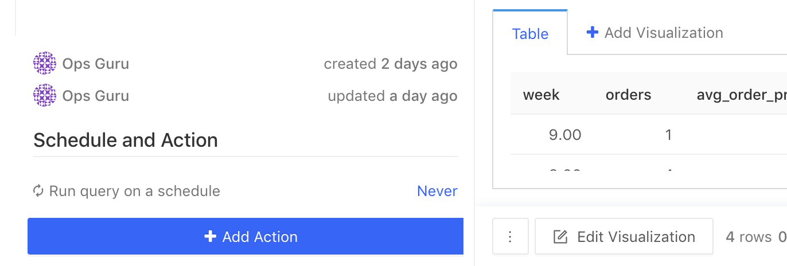
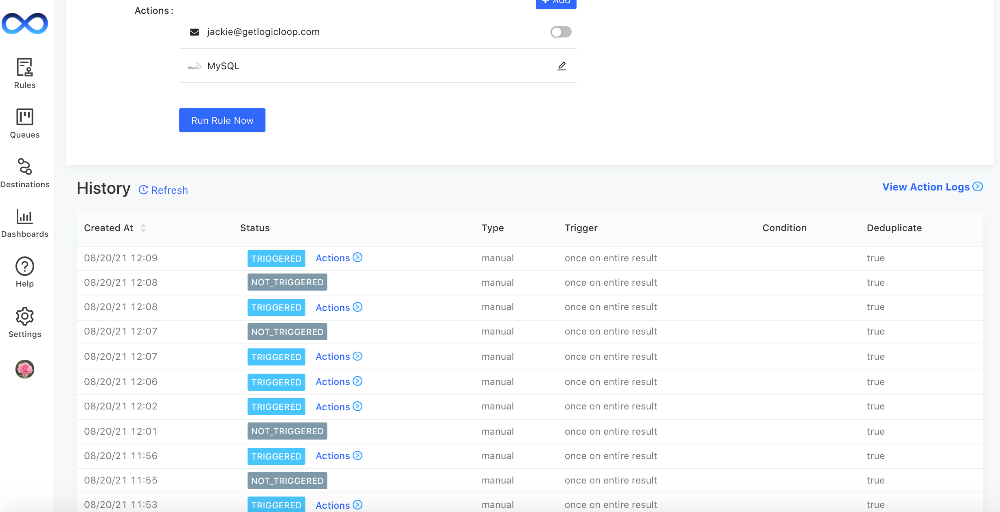
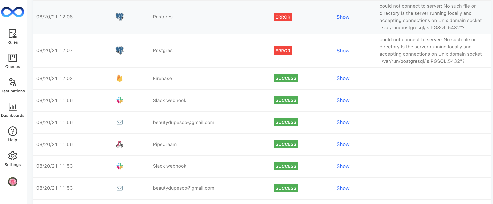

# Set up an action

## Configure your action settings

LogicLoop lets you run your rules on a schedule and trigger automated actions. No need to spend time manually refreshing dashboards or manually exporting data between applications.

You can use actions to raise alerts via [Slack](destinations/slack.md) and [Email ](destinations/email.md)to monitor your processes, or use webhooks to integrate your rules into downstream workflows like [Zapier](destinations/zapier.md) or even custom internal flows.&#x20;

You can add an action to your rule by clicking the **+ Add Action** button in the bottom left corner of the [Rule](../queries/rules/) source view.

Now you can configure your new action:

* **Name**
* **Trigger** your action once on the entire result set of the rule, or trigger a separate action for each individual row returned. If your rule does not return any rows, the action will not be triggered.
  * **Advanced Triggers:** You also have the option to split your actions into batches or group by a column value. You may want to leverage batches if there are limitations on your destination's capacity. Grouping by a column will split the result set into batches according to their column value, and the action will run once on each batch.
* **Deduplicate** if you do not want to take action again on a row whose **`id`** field has been seen before. In order to enable this feature, your SQL query must return an **`id`**field. A clever way of doing so is by naming whichever column you wish to designate as the identifier as **`id`** in your SQL query e.g.`select user_id as id from accounts`
  * **Re-alert after a period of time** if you want to re-alert on an item after a period of time. This is only relevant when you are using deduplication&#x20;
* **Add a condition** if you only want your action to take place if a certain threshold criteria is met.
* **Rate limit -** if your alert triggers an action for each row returned and your query returns a large number of rows, you may want to limit the rate at which the actions are triggered to prevent flooding downstream APIs. Go to **Edit** action and hit **Additional Settings** to specify that you don't want to trigger more than **X** actions per **N** seconds.

<figure><figcaption></figcaption></figure>

LogicLoop will act upon up to the first 1000 rows returned from your query.

## Create an Action Destination

Once you have created your action, the next step is to start adding **Action Destinations.** Click on the **Destinations** tab on the left navbar and then hit **+ New Action Destination**

Next, select the type of destination you want to configure. You can find more details on how each action destination works under [Action destinations](destinations/).

### Test Action Destination

Once you have setup your destination, you can verify your connection with the **Test Connection** button.

<figure><figcaption></figcaption></figure>

### View Destination Alerts

When viewing a destination, you can see all alerts associated with that destination.

<figure><figcaption></figcaption></figure>

## Create an Action Subscription

Once the destination is configured, you can go back to your action's page and click **+ Add.**

You will see a list of all the action destinations you've configured and you can choose which ones you want your rule to subscribe to. You can customize the format of the data you pass through to your downstream action using our [templating guide](templating.md).

You can now click **Run Rule Now** to test your actions. The status of your action on the right bar will change from **Unknown** to **Triggered** or **Not Triggered**. You’ll want to ensure your rule’s query runs correctly before triggering the action.

### Toggle Action Subscription

You can toggle your action subscriptions on or off. This allows you to test out new actions while leaving existing subscriptions in place without re-triggering them.&#x20;

<figure><figcaption></figcaption></figure>

\
History and Logs
----------------

If you want to see a history of your rule runs and actions, go to **Settings > General** and turn on **Record and show history of rule runs** under Logs. (You must be an admin user.)

Below your action, you can now see a log of every time the rule was run with information on: when it ran, what its status was, how it was triggered, and what conditions it ran under.

You can also see a history of all the actions that were taken, including payloads sent to third-party services and error messages returned.

Make sure to refresh the page after every run rule to view the latest logs. Logs are stored for up to 30 days.
