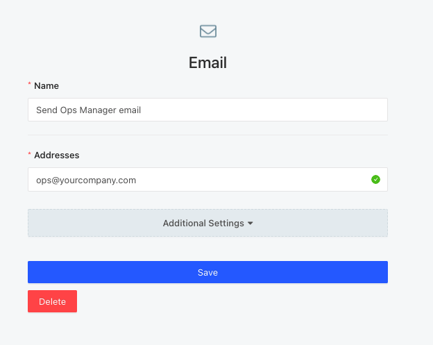

# Email

One common use case is you will want your rule runs to trigger emails. These can be internal emails sent to your ops team, or external emails sent to your end-facing customers. Email Action Destinations are fairly simple to set up - you just need to enter the email address you want to send to.

## Email notification template

Once you setup your rule's action to trigger the email destination, you will be able to edit the email's template. You can read more about how to [template your notifications here](../templating.md).

Here's a sample email template:


If you leave the **To** field blank it will default to the **Address** field you configured in your action destination. Otherwise, the **To** field will override the **Address** field configured in the destination. You can either hardcode your recipient e.g. To: support@getlogicloop.com, or you can encode a recipient e.g. \{{ ROW\_EMAIL \}} so that emails get sent to different addresses per row returned from your rule. This comes in handy, for example, if your rule pulled up a list of emails for customers you wanted to contact and you want to send an email to each one.&#x20;



You can specify multiple recipients by separating them with a comma e.g. one@gmail.com, two@gmail.com


Here is what the actual email will look like:

.png>)

You can also attach a CSV file of your query results to the email by selecting the **Attach CSV** option


By default, emails are sent from hi@getlogicloop.com, but we can help you configure emails so that they are sent from your domain e.g. support@yourcompany.com. Email us at hi@getlogicloop.com if you wish to enable this feature.


Note that the email's body field is interpreted as HTML so you can generate stylized emails such as this one by pasting in the relevant HTML/CSS code in the email body:

### Sending emails from your own company domain

By default, all emails are sent from LogicLoop's domain e.g. hi@getlogicloop.com. If you'd like your emails to come from your own domain instead e.g. you@yourco.com, when you create your Email Destination, you can fill in your own custom email to send from under Additional Settings:&#x20;

<figure><figcaption></figcaption></figure>

For this to work correctly, you will need to whitelist LogicLoop's email address credentials on your domain name provider. Email hi@getlogicloop.com for help setting this up.&#x20;

### Sending emails from your own SMTP provider


Sending emails through your own SMTP provider is available only on the Enterprise Plan


If you would like to send mail through your own email provider e.g. AWS SES, Sendgrid, Google, etc. please send us your SMTP credentials:

* your mailserver's address, e.g. email-smtp.us-west-2.amazonaws.com&#x20;
* your mail port, e.g. 587
* whether you use TLS
* your mail username and password&#x20;
