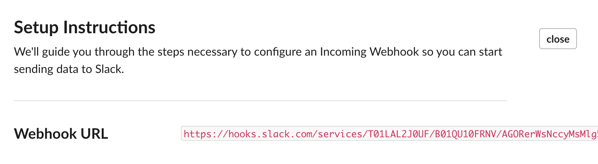

# Slack

One of the most common use cases for LogicLoop is to have your rule post a message to a Slack channel.

## Integrate Directly with Slack&#x20;

Follow our [integration guide](../../teams/integrations/slack.md) to get your LogicLoop workspace connected with Slack.&#x20;

## Slack Notification Template

You can customize the format of your Slack notification to include all the information your operator will need to know. You can read more about how to [template your notifications here](../templating.md).

Here's an example of Slack notification template:

And here is what it will look like when it triggers an actual Slack message:

### Attach CSV Results

You can attach a CSV file of your query results to your Slack message.

<figure><figcaption></figcaption></figure>


Slack has a 3000 character message limit. We recommend adding a link to a dashboard or results to prompt further investigation.


## Legacy Option: Create Slack App

### Get an API token&#x20;

#### Create a pre-configured app

The most common way of interacting with the Slack API is by creating a Slack App Integration. Begin by navigating to the this tutorial on [How to quickly get and use a Slack API token.](https://api.slack.com/tutorials/tracks/getting-a-token) Scroll down to the _Create a pre-configured app_ section and click _Create app_.

.png>)

#### Configure your Slack App

Next, select the workspace that you want to interact with (read from or write to), and click _Next_. To give the app a recognizable name and description, click _Edit Configurations_ and change the values of `name` (you will need this later) and `description`. Finally, click _Next_, then _Create_.

#### Get your Slack API Token

Under _Install your app_, click _Install to Workspace_, and select _Allow_. At the top of the screen you should see a message telling you to head back to the tutorial. Click the link in the message.


If the _Install to Workspace_ button is disabled, you may need to add _permission scopes_ to your app. On the left menu, under _Features_, you should see _OAuth & Permissions._ Click that, scroll down to the _Scopes_ section and add the _Bot Scopes_ that fit your use case.


.png>)

If you scroll down to the section _Using your token_, you can find the API token populating a black box (starting with `xoxb`). **Save that token somewhere safe, you will need it.**

&#x20;

.png>)

### Write a notification to a Slack Channel

We now want to write notifications to Slack. We will send `POST` API requests by using the [Webhook Builder](webhooks.md#webhook-builder) Action Destination. To do this in LogicLoop, select _Destinations_ from the left side menu, click the _New Action Destination_ button on the top right, and choose _Webhook Builder_ from the menu.

You can see how to create the Slack Destination and Action [here](webhooks.md#post-to-slack).

## Legacy Option 2: Slack Incoming WebHook

To have your rule ping a Slack channel all you need is your **Slack Incoming WebHook URL** [which you can create here](https://my.slack.com/services/new/incoming-webhook/) or choose from your [existing Slack WebHook URLs here](https://logicloop-workspace.slack.com/apps/A0F7XDUAZ-incoming-webhooks?tab=settings\&next\_id=0). You can read more about Slack's WebHooks [here](https://api.slack.com/messaging/webhooks).

Through Slack's interface, you will be able to choose a channel you want your webhook to post to.

Once you select a channel and click **Add Incoming WebHooks integration**, you can copy the Slack Webhook URL that is returned.

Paste the Webhook URL to your LogicLoop [Action Destination](../actions.md) under **Slack Webhook URL.**

Once the Slack Action Destination is set up you can go to your [rule's action page and add the Slack destination](../actions.md) so that every time you rule runs, it will generate a Slack alert if the criteria is fulfilled.&#x20;

