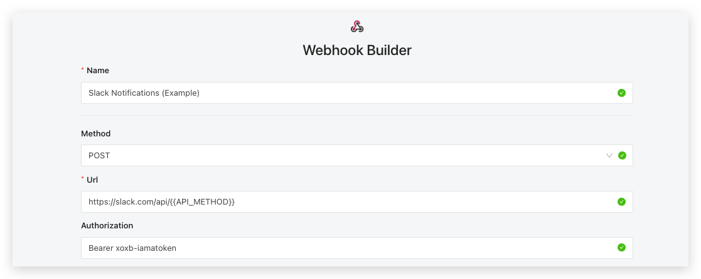
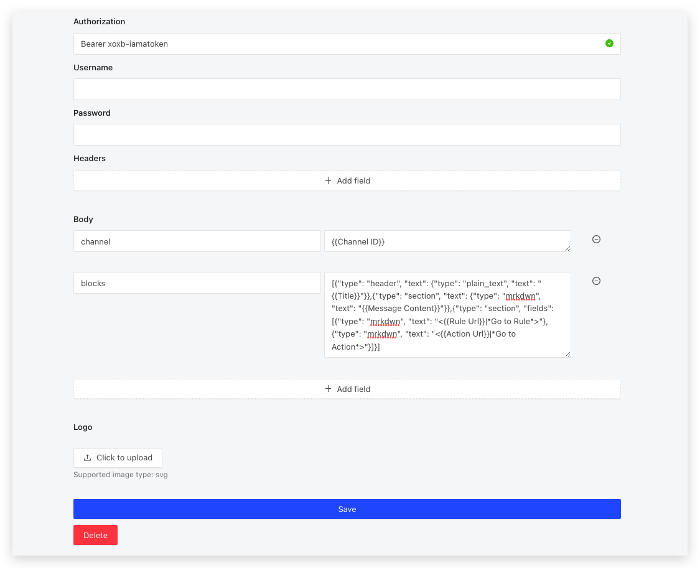
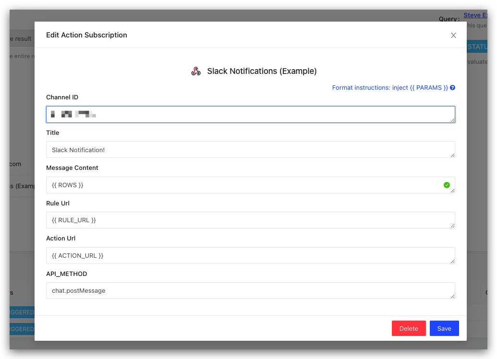

# Webhooks & APIs

The Webhook Builder destination allows you to configure LogicLoop to send data to external services via HTTP requests. This can be useful for integrating your data with third-party services, automating workflows, and more.

## Webhook Builder

### Configuration

To set up a webhook destination, you need to fill in the following fields:

#### Input Fields

* **Name** (required): A descriptive name for your webhook destination.
* **Method** (required): The HTTP method to use for the request. Options are: `POST`, `GET`, `PUT`, `PATCH`, `DELETE`.
* **URL** (required): The endpoint URL where the request will be sent.
* **Authorization** (optional): Any authorization token required by the endpoint.
* **Username** (optional): The username for basic authentication.
* **Password** (optional): The password for basic authentication.
* **Headers** (optional): Additional headers to include in the request. This is a key-value field.
* **Body** (optional): The body of the request. This is a key-value field.
* **Logo** (optional): Upload an SVG image to represent this webhook destination.

<figure><figcaption></figcaption></figure>

#### Templating

You can use LogicLoop templating in these fields using the `{{parameter}}` notation. For more details on how to use templating, please refer to our [Templating Guide](../templating.md).

### Test Webhook Connection

Under 'Additional Settings,' you have the option to test your webhook connection before finalizing your setup. The fields available for testing are:

* **Test URL**: The URL to send the test request to.
* **Test Headers**: Headers to include in the test request. This is a key-value field.
* **Test Body**: The body of the test request. This is a key-value field.

Testing your webhook connection ensures that the configuration is correct and the external service is reachable.

### Twilio Example

To set up your rule to trigger a webhook, first go to **Action Destination** and create a new **Webhook Builder** destination. The webhook builder will allow you to construct your webhook request by entering the required method type, URL, Authorization headers, and body. The following example shows you how you can use the **Webhook Builder** to set up a webhook integration with [Twilio](https://www.twilio.com/), but it can be used for any service that exposes an API including Zapier, Stripe, Asana, Sendgird, Whatsapp, and even your company's own internal API endpoints.


What's powerful about the webhook builder is that a technical team member can configure it once with the correct header and body structure, and they can insert whatever parameters they want for a non-technical user to later plug and play. In this example, we've decided to create two variables called `PHONE_NUMBER` and `TEXT_MESSAGE_COPY` available for replacement.

Next, to use this Twilio webhook integration, a non-technical member can go to their **Action** and add the Twilio integration to be triggered every time their rule runs. The will see the two parameter fields that were made available in the destination configuration that they can fill in. The non-technical member can change the copy of the text message or the phone number it goes out to at any time without involving an engineer to rebuild the webhook integration.


If the phone number and text message changes depending on which user you are sending the text to, you can even inject variables from the result of your queries into your notification as you can with any of our [action subscription templating variables](../templating.md).&#x20;


Here's what this Twilio text message would look like when received by the user:

<div align="left">


</div>

If you run into any issues, you can go into your alert's [Action Logs](../actions.md) to see what the error was.


### Post to Slack

Start by giving your webhook a name, and setting the method to POST.&#x20;

<figure><figcaption></figcaption></figure>

\
Give it a url. Above, we set the base url, and used a template, `{{API_METHOD}}` , for the specific endpoint. This allows you to choose the endpoint when creating an alert with this Destination.


For posting to Slack, you'll likely use `chat.postMessage` as your endpoint, though you can see all other options [here](https://api.slack.com/methods).


Add Body fields for API Call.

<figure><figcaption></figcaption></figure>

Again, we use templates so you can specify the _Channel ID_, _Title_, and _Message Content_ (along with _Rule Url_ and _Action Url_. You can copy and paste our example _blocks_ section here:

```
[{"type": "header", "text": {"type": "plain_text", "text": "{{Title}}"}},{"type": "section", "text": {"type": "mrkdwn", "text": "{{Message Content}}"}},{"type": "section", "fields": [{"type": "mrkdwn", "text": "<{{Rule Url}}|*Go to Rule*>"}, {"type": "mrkdwn", "text": "<{{Action Url}}|*Go to Action*>"}]}]
```

Lastly, you want to create the actual alert.

<figure><figcaption></figcaption></figure>

To get the channel id, open slack and navigate to the specific channel. Click the channel name at the top, and a pop-up should open. The _About_ tab of the pop-up will have the _Channel ID_ at the bottom.


You can also create an alert that sends messages to a dynamically specified channel.&#x20;

First, the rule would need a Channel ID column (you can name it `channel_id`).&#x20;

Then you would have to set your Action to run _For each row returned_.&#x20;

Lastly, you would set _Channel ID_ in the form above to `{{ channel_id }}`.


## Webhook (Basic)

Alternatively, you can also use our raw **Webhook** destination instead of the **Webhook Builder** if you want to be able to directly construct the body and headers to be sent as raw JSON. First, go to your **Action Destinations** and create a new destination of type **Webhook**. Enter a name, URL, and Authorization headers (if any) of your endpoint.


Next, go to your **Action** and add the webhook action subscription. Enter additional information for your webhook which will include the method, URL, headers and body.


You may leave the URL field blank, in which case the URL will be the one you configured when you created the action destination. If you do specify a URL, it will override the URL you configured in the action destination.




The headers and body fields must be valid JSON. The header fields that you enter in the header section will be appended to default headers that are automatically sent, such as the **Authorization**. The default content-type is application/json, but you may override this by entering "content-type": "application/x-www-form-urlencoded" in the headers if you wish to use URL encoded format instead.&#x20;



Header keys and values must be strings in double quotes -- as you can see in the example, you need to specify "\{{ ROW\_EMAIL \}}" not just \{{ ROW\_EMAIL \}}. The body can take nested JSON values as well. Note that in the example we write "Data": \{{ ROW \}}, instead of "Data": "\{{ ROW \}}" because \{{ ROW \}} is a valid JSON structure. For URL encoded content type nested structures are not currently supported.


Here's what this webhook request payload looks like when sent:


