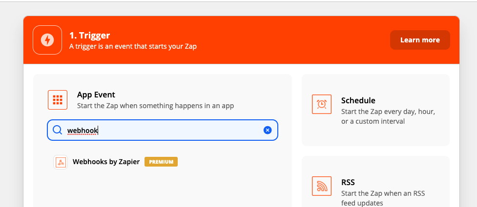
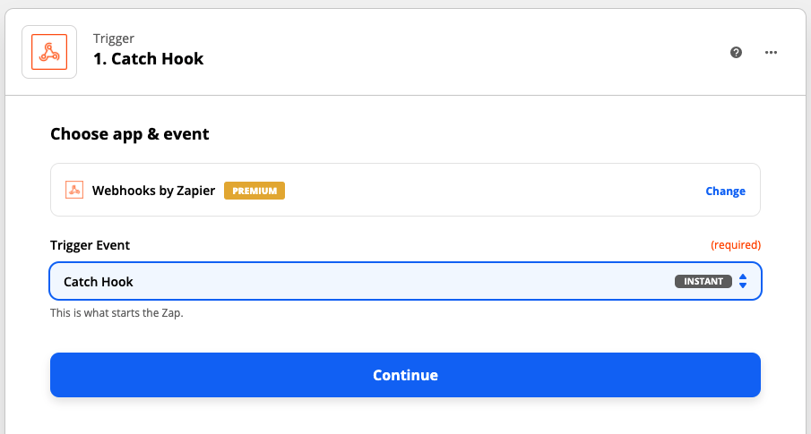
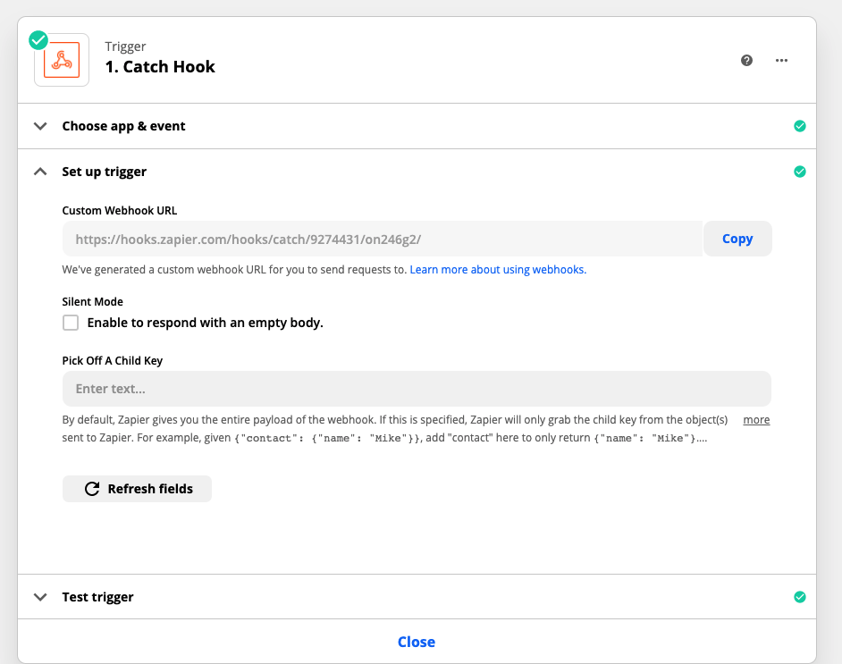
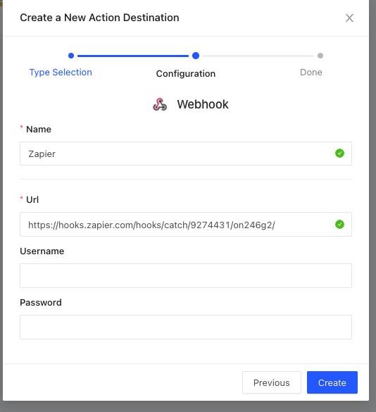
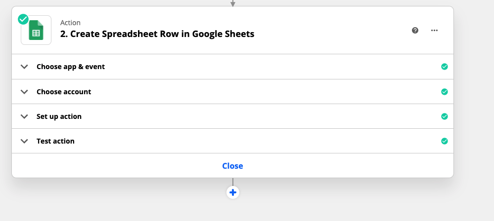

# Zapier

You can have your rule trigger a Zapier webhook endpoint if you want to take advantage of the myriad of integrations available on Zapier.&#x20;

First, create a Zap in Zapier that is triggered by **Webhooks by Zapier.**

Then choose the event ‘Catch Hook’

Copy and paste the **Custom Webhook URL** to get your custom endpoint. Create an action destination in LogicLoop of type [Webhook](webhooks.md) and put in the URL you copied from Zapier.

Add your Zapier webhook to a rule and run it to test that the endpoint is being hit properly. Then, you can go into Zapier and add whatever action you would like Zapier to take when it's triggered. For example, you can have Zapier create a new Google Sheets row with the data from your LogicLoop query.

You will have to do some mapping to ensure the data passed from LogicLoop is in the format you want to be passed into the Zapier action.

.png>)

With Zapier you can set up your LogicLoop queries to trigger any number of actions such as creating Google Docs, Sheets, Calendars, Forms, creating Trello/JIRA tasks, posting to social media, syncing to Dropbox, Salesforce, Mailchimp, and many more. [You can explore all Zapier integrations here](https://zapier.com/apps).
