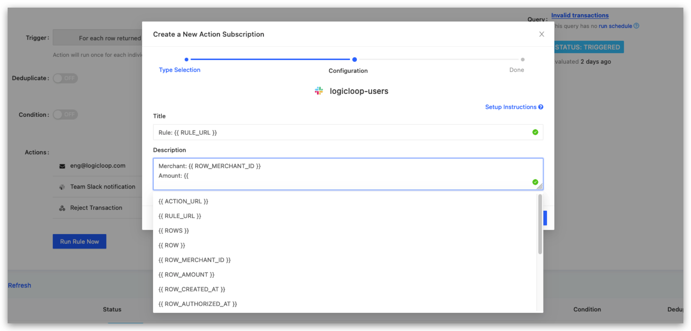

# Templating

For all of your actions, you can customize the notifications that are sent downstream to contain all the relevant information the destination needs to know about. You can inject these parameters into your action subscriptions within curly braces:

* **`{{ ACTION_URL }}`**- The action page url (string)
* **`{{ RULE_URL }}`** - The corresponding rule page url (string)&#x20;
* **`{{ ROWS }}`** - The rule query result data (JSON array)
* **`{{ ACTION_LOG_URL }}`** - The action log for an individual alert (string)


LogicLoop action templating is based on **mustache**. You can learn more [here](https://mustache.github.io/mustache.5.html).


### Parameter Selection

When creating or editing an action subscription, input boxes that support template parameters will have a button on the right to bring up your available template parameters. Select the parameter you wish to use in your subscription.

<figure><figcaption></figcaption></figure>


When using templating and parameter selection in GitBook documentation, ensure that the case of your parameters matches exactly with the columns returned by your SQL query.


### Autocomplete

LogicLoop provides autocomplete suggestions for template parameters when editing [action](actions.md#create-an-action-subscription) or [ticket action](../case-management/case-management/#ticket-actions) subscriptions. The parameter options will automatically appear below once you type the opening curly braces.

<figure><figcaption></figcaption></figure>

### Once on entire result set

To generate a digest of all rows returned, you can iterate over the `ROWS` object and reference column names&#x20;

.png>)

<details>

<summary>View code</summary>

```
{{ #ROWS }}
Count: {{ count }}
Amount: {{ amount }}
Payment: {{ payment_status }}
Event: {{ event }}
{{ /ROWS }}
```

</details>

This generates the following Slack digest:

.png>)

### For each row

If your action is configured to raise a notification for each individual row returned (as opposed to once on the entire result), you will also have access to these additional parameters:

* **`{{ ROW }}`** - Data of the specific row returned (JSON dict)&#x20;
* **`{{ ROW_[COLUMN_NAME] }}`** - The specific value of that column in that row (string)

Your action must be set to trigger for each row returned to access these variables.

<figure><figcaption></figcaption></figure>

The following example operates against a query that returned results with this structure:


Here's an example of a Slack notification template with injected parameters:

.png>)

<details>

<summary>View code</summary>

```
A large transaction has been found
ID: {{ ROW_ID }}
Amount: {{ ROW_AMOUNT }}
Category: {{ ROW_CATEGORY }}
Created at: {{ ROW_CREATED_AT }}

Please go here to approve or reject: https://admin.company.com/transactions/{{ROW_ID}}
```

</details>

Here's how the Slack notification actually looks:

.png>)


If you choose not to customize and leave the configuration fields blank, we will use the default system template (shown as light grey placeholders in the action subscription form).


### Indexing into object

LogicLoop supports dot notation when your information contains nested fields. You separate the identifiers with the period (.) symbol as the membership operator.

<figure><figcaption></figcaption></figure>

<details>

<summary>View code</summary>

```
{{ #ROWS }}
Zip Code: {{ address.zip.z_code }}
{{ /ROWS }}
```

</details>

#### Indexing in a 'For Each Row' column object

Dot notation is also supported in 'For Each Row' results. You can also iterate through individual results that contain lists or arrays.

<figure><figcaption></figcaption></figure>

<details>

<summary>View code</summary>

```
{{ #ROW_USER }}
Name: {{ name }}
Street: {{ address.street }}
Zip Code: {{ address.zip }}
{{ /ROW_USER }}
```

</details>

