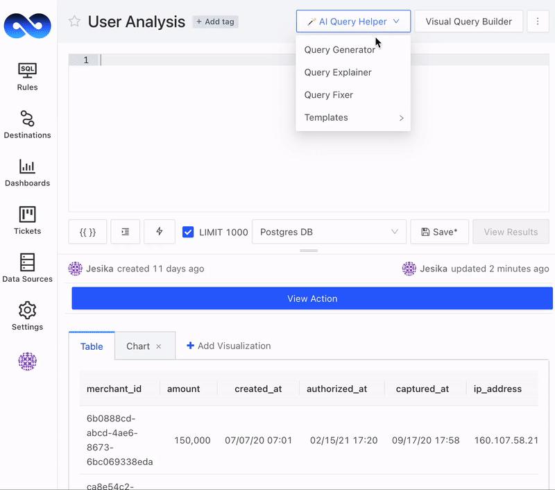
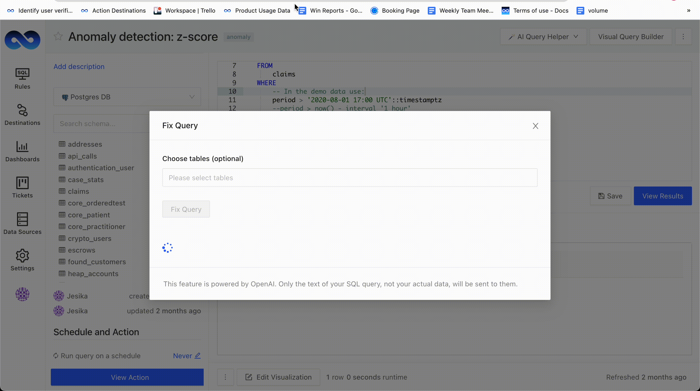

# AI Query Helper

LogicLoop's AI Query Helper is a tool that simplifies the process of querying data from a database. The tool has three functions, Query Explainer, Query Generator, and Query Fixer, which can help users understand and generate complex SQL queries in a matter of seconds.


The AI SQL Helper is currently only supported for SQL based datasources like MySQL, Postgres, Snowflake, Big Query, and Redshift. LogicLoop accounts come preloaded with a "Sample Postgres DB" you can use for testing.


### AI Query Explainer

<figure><figcaption></figcaption></figure>

The Query Explainer is a feature that allows users to understand a SQL query in plain English. It helps users who are unfamiliar with SQL to understand what a query does without having to learn the SQL language.

To use Query Explainer, open the query you want explained. On the right sidebar, select **AI Query Helper -> Query Explainer.** The Query explainer will open, and you can select the "Explain Query" button. The tool will then provide a plain English explanation of the query.&#x20;

### AI Query Generator

<figure><figcaption></figcaption></figure>

The Query Generator is a feature that allows users to create a SQL query in plain English. Users can describe what they want to query, optionally choose the tables they want their query to run on, and generate SQL.

To use Query Generator, open a new rule. On the right sidebar, select **AI Query Helper -> Query Generator.** The tool will then prompt you to describe what you want to query in plain English. For example, you might say "I want to query all the customers who bought a product in the last month."&#x20;

You can also choose which tables you want your query to run on. Simply select the tables you want to include in your query and the tool will generate SQL code that queries those tables.\
\
Once you have described what you want to query, the tool will generate SQL code that you can use. You can copy & paste the SQL code in your editor and hit "View Results" to see the data. Keep in mind it's always well-advised to double check and tweak the AI generated results to suit your use case.&#x20;

### AI Query Fixer

<figure><figcaption></figcaption></figure>

The AI Query Fixer suggests improvements and syntax fixes to your SQL query, so you're never stuck debugging it.&#x20;

To use Query Fixer, open a rule. On the right sidebar, select **AI Query Helper -> Query Fixer.** The tool will then prompt you to select tables (optional), and you click **Fix Query** to fix the query of the rule you currently have open. You can copy & paste the SQL code in your editor. Keep in mind it's always well-advised to double check and tweak the AI generated results to suit your use case.&#x20;

### AI Query Editor

The AI Query Editor feature allows users to describe specific changes they want to make to a query. This feature simplifies the process of modifying existing queries by providing a plain English description of the desired changes. The AI then interprets these instructions and adjusts the query accordingly.

To use Query Editor, open a rule. On the right sidebar, select **AI Query Helper -> Query Editor.** The tool will then prompt you to describe your desired changes and select tables (optional), and you click **Edit Query** to edit the query of the rule you currently have open. You can copy & paste the SQL code in your editor. Keep in mind it's always well-advised to double check and tweak the AI generated results to suit your use case.&#x20;

### AI Query Optimizer

The AI Query Optimizer improves the performance of your SQL queries without requiring additional input. This feature automatically analyzes and enhances the efficiency of your queries, ensuring faster execution and optimal resource utilization.

To use Query Optimizer, open a rule. On the right sidebar, select **AI Query Helper -> Query Optimizer.** You can copy & paste the SQL code in your editor. Keep in mind it's always well-advised to double check and tweak the AI generated results to suit your use case.&#x20;

### Previous Responses

The Previous Responses feature, included in the AI sidebar, provides a history of responses from the AI Query Helper for the last three days.

### Send Feedback

The Share Feedback feature helps LogicLoop gather user insights and improve the tool based on user experiences, please share!


This feature is powered by third-party LLM providers. If you use this feature, only the text of your SQL query or your data schema format will be sent to these providers. None of your actual data will be sent.


