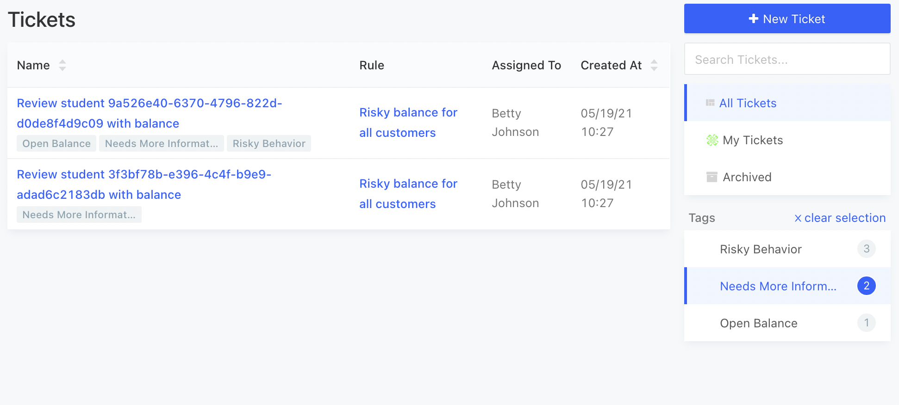
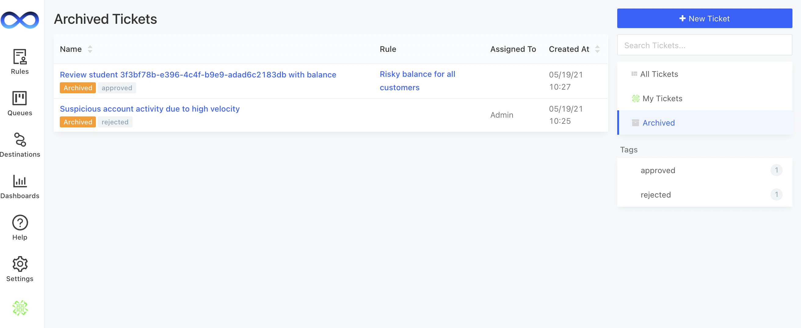

# Case Triage

## Tagging Tickets

You can attach tags to tickets for easy filtering. For example, you may want to create tags for different types of cases e.g. suspicious activity vs revenue growth. You may also want to create tags for different stages of review e.g. new, pending review, collecting information, approved or rejected.

You can also view all tickets assigned to you under the **My Tickets** tab on the right. Tickets can also be searched by name and description.

## Ticket Actions

After your ticket has been created, a human can follow up on that ticket and manually execute an action on it e.g. Approve or Deny a user.

In order to enable this feature, go to the 'Queues' tab on the left navbar and click on 'Settings' on the right tab to configure your Ticket Actions. You will be able to select from all the action types you've set up under Action Destinations.&#x20;

Some examples of Ticket Actions you may want to configure are:

* A [webhook endpoint](../../actions/destinations/webhooks.md) that calls your internal admin service to update a user's information
* A [Slack message](../../actions/destinations/slack.md) that alerts your team that an application's status has changed&#x20;
* An [email](../../actions/destinations/email.md) to the user letting them know that their application has been approved or denied

.gif>)

You'll be able to create a [template](../../actions/templating.md) for your actions to specify the exact shape of the information you'd like the action to pass through. Your template will pull data in from the data field that is attached to your ticket.

<figure><figcaption></figcaption></figure>

Once you've configured your Ticket Actions, you can click on any of your tickets and click **Take Action**. Select from the list of available actions to execute the action on that ticket.

<figure><figcaption></figcaption></figure>

## Archiving Tickets

To mark a ticket as done or complete, you can click the **option drop** button in the top right corner and select **Archive**.

<figure><figcaption></figcaption></figure>

Archived tickets can still be found under the Archived tab.

### Batch Archiving Tickets

You can batch archive tickets from the case management homepage. You can select all tickets shown or individual tickets and then select **Actions -> Archive**.

<figure><figcaption></figcaption></figure>

## Ticket Filtering

The LogicLoop **Tickets** page supports filtering for convenient navigation and analysis of your cases. Tickets can be filtered by creating rule and assignee.

<figure><figcaption></figcaption></figure>

 

<figure><figcaption></figcaption></figure>

