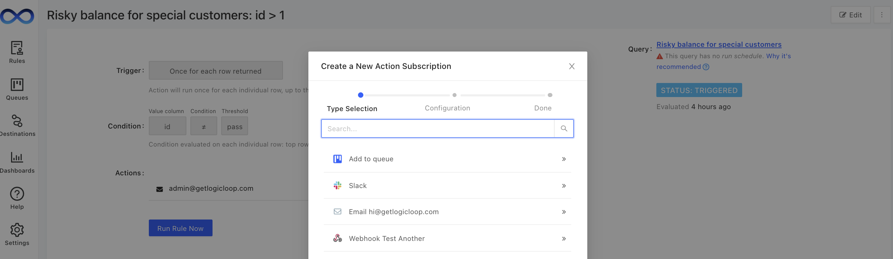
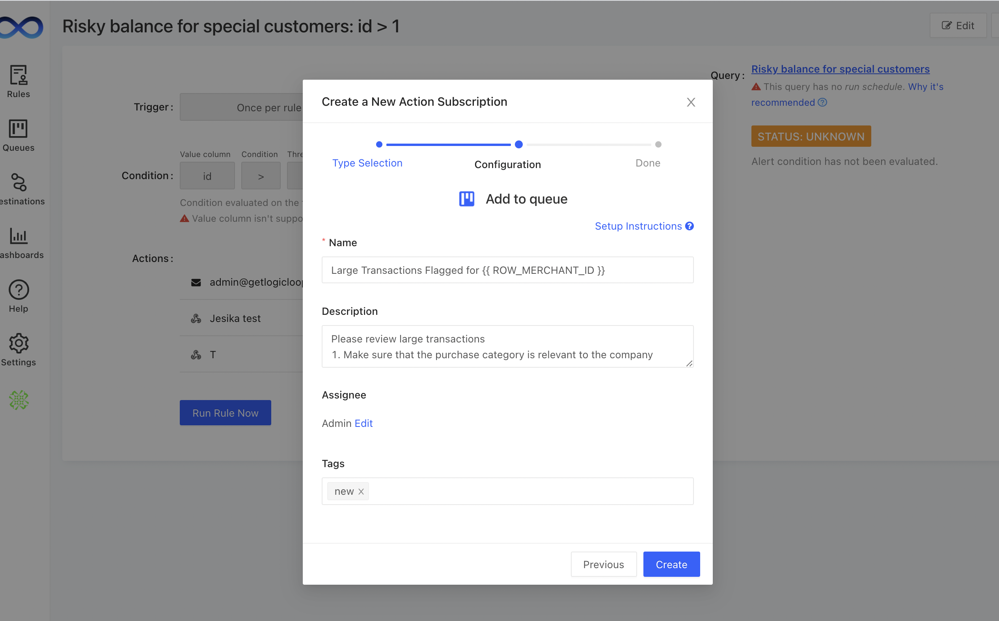
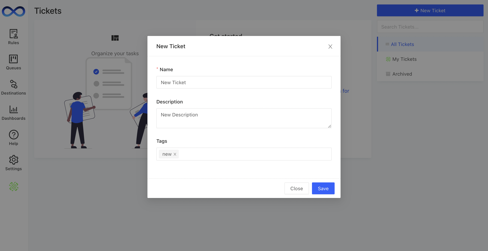

# Ticket Generation

## Automated ticket generation

You can set up your rules to automatically generate tickets when an action is triggered. All you have to do is [create an action subscription](../../actions/actions.md) that adds a new ticket to your queue. You can either create 1 ticket for the entire result set returned from the rule, or a separate ticket for each individual row returned from the rule run. The new ticket will be pre-populated with information you configure and will automatically attach the associated data from your rule run.

To enable this, go to your action and add a new subscription with the **Add to queue** icon shown below:

Next, enter the information you want to populate into your ticket, including who you want to assign the ticket to and any additional tags you want to add for triage:

Now, every time your rule runs, if the action criteria are met, it will generate a new ticket in your **Tickets**.

### Group tickets with entity ID

When you create ticket automatically, you might create lots of tickets for the same entity, e.g. a user has been flagged in many tickets, or a transaction has been caught by many rules. To reduce the amount of "duplicate" tickets created for the same entity, you can specify the **Entity ID** and check **Group items with the same entity ID into a single ticket** under **Advanced Settings** when creating or editing Action Subscription.&#x20;

<figure><figcaption></figcaption></figure>

The first case generated under the entity ID will create a ticket. All the other cases under the same entity ID will be put into the **Additional Rules Flagged** section within the first ticket. When you archive the ticket, it will archive all the cases under that ticket.&#x20;

<figure><figcaption></figcaption></figure>

### View Additional Ticket Data

To view the data of subtickets, select **View Data**.&#x20;

<figure><figcaption></figcaption></figure>

The data will be presented in a pop-up, allowing you to continue your investigation of the case without leaving your base ticket.

<figure><figcaption></figcaption></figure>

## Manual Ticket Creation

You can also create a new ticket manually by clicking on the **+ New Ticket** button and filling out the information for your ticket.

You can click on a ticket's name to view or edit it. You can edit its name, description, assignee, notes, and tags. Html syntax is supported in description so you can change the font or add a link easily. You can also work on the ticket with your colleague by adding comments. &#x20;

<figure><figcaption></figcaption></figure>

You can also share a link to a ticket by copy & pasting its URL e.g. `https://yourco.getlogicloop.com/tickets/1`

### Add Attachment on Creation

When creating a ticket manually, you have the option to upload an image attachment with the creation of the ticket.
