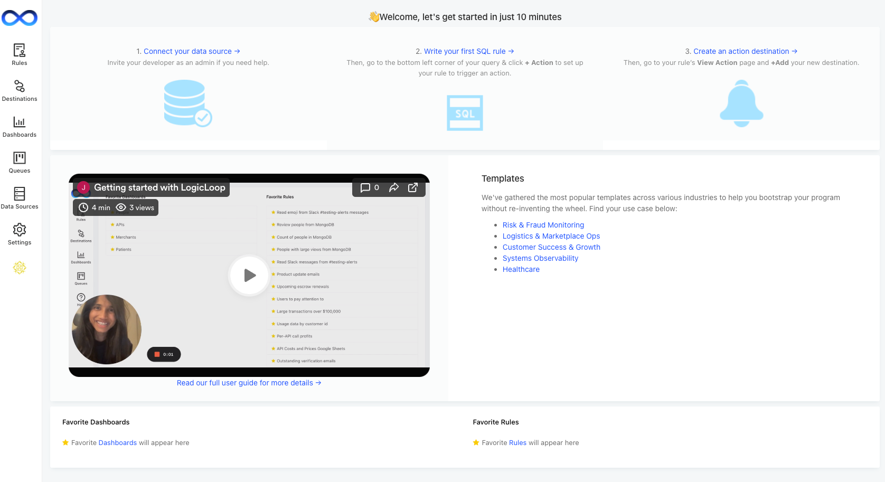

# Changelog

### May 31, 2024 (2.19.9)

[Ticket Attachments](case-management/case-management/custom-fields-and-attachments.md#ticket-attachments) now available in Case Management

Test [webhook destination](actions/destinations/webhooks.md#webhook-builder) connections

Trigger actions [grouped by column](actions/actions.md#configure-your-action-settings)

### April 29, 2024 (2.19.6)

Added Microsoft Teams as [destination](actions/destinations/microsoft-teams.md)

Attach CSV of query results to [Slack alerts](actions/destinations/slack.md#attach-csv-results)

[AI SQL Copilot](ai/ai-query-helper.md) moved to sidebar

### Apr 15, 2024 (2.19.5)

Support [viewing subticket data](case-management/case-management/ticket-generation.md#view-additional-ticket-data) for grouped tickets

Added [filter by destination](queries/rules/more-rule-options.md#filter-by-destination) on Rules page

UX Filtering improvements

### Apr 1, 2024 (2.19.3)

Display [list of associated alerts](actions/actions.md#view-destination-alerts) below any destination

Added [filter by data source](queries/rules/more-rule-options.md#filter-by-data-source) on Rules page&#x20;

Enabled [Oracle](data-sources/supported-data-sources/oracle.md) as a [data source](data-sources/supported-data-sources/)

Display [list of associated rules](data-sources/data-sources/#view-data-source-rules) below any data source

### Mar 18, 2024 (2.19.1)

Column type support added to [AI Query Helper](ai/ai-query-helper.md)

Extended[ AI Query Fixer](ai/ai-query-helper.md#ai-query-fixer) descriptions for what should be fixed

Support verifying destination connections with [Test Connection](actions/actions.md#test-action-destination)

### Mar 4, 2024 (2.18.7)

Add ACTION\_LOG\_URL to built-in [templating parameters](actions/templating.md)

Show query results in [Ask AI](ai/ask-ai.md)

Form-based input for [Google Sheets data source](data-sources/supported-data-sources/google-sheets.md#reading-your-google-sheet)&#x20;

### Feb 19, 2024 (2.18.5)

Run SQL generated by AI

Expand [PagerDuty destination](actions/destinations/pagerduty.md) with Custom Details

### Feb 12, 2024 (2.18.4)

Added more [databases as destinations](actions/destinations/write-to-database.md): Snowflake, Microsoft SQL Server, BigQuery, sqlite, Redshift, Databricks, RDS mySQL

Added action failure notification

### Jan 19, 2024 (2.18.1)

Rule run and action count stored and displayed on homepage

[Template parameters](actions/templating.md) now available in [Slack messages](actions/destinations/slack.md)

### Dec 28, 2023 (2.17.6)

Increased channel limit for [Slack integrations](teams/integrations/slack.md)

Expanded data available in [LogicLoop Data Source](data-sources/supported-data-sources/logicloop-data-source.md)

### Nov 17, 2023 (2.17.0)

Support for [Advanced Scheduling](queries/rules/more-rule-options.md#advanced-scheduling) live

Upgrade default AI Query Helper to gpt3.5

Add in-app data source customer support

### Oct 13, 2023 (2.16.7)

Support [MySQL data source](data-sources/supported-data-sources/mysql.md) SSL file upload

Add [Azure MySQL](data-sources/supported-data-sources/mysql.md) as data source

### Sep 29, 2023 (2.16.6)

Add run logs table to [LogicLoop Data Source](data-sources/supported-data-sources/logicloop-data-source.md)

Add scheduling to [Action Setup](actions/actions.md)

### Sep 7, 2023 (2.16.4)

Add Query Optimizer to [AI Query Helper](ai/ai-query-helper.md)

Support Athena in [AI SQL API](beta/ai-sql-api.md)

### Aug 18, 2023 (2.16.2)

Added button to insert [template parameters](actions/templating.md) into [action subscriptions](broken-reference)

Increased [Slack integration](teams/integrations/slack.md) channel limit from 1000 channels to 10,000 channels

Added database schema retrieval API for [AI SQL generation](beta/ai-sql-api.md)

Added database schema update API for [AI SQL generation](beta/ai-sql-api.md)

### Aug 6, 2023 (2.16.1)

Added database schema creation API for [AI SQL generation](beta/ai-sql-api.md)

Support table selection from data schema for [AI SQL generation](beta/ai-sql-api.md)

### July 6, 2023 (2.15.6)

Multiple new AI models are avilable in the [AI SQL generation API](beta/ai-sql-api.md) (gpt-4, gpt-3.5-16k, Anthropic Claude)

Additional UI filtering for [Rules](queries/rules/), including author

Additional UI filtering for [Tickets](case-management/case-management/), including creating rule

Ticket row data is now available in [Case Analytics](beta/case-analytics.md)

### June 15, 2023 (2.15.3)

Google Sheets added as an Auth Integration [service](data-sources/supported-data-sources/google-sheets.md)

Add Batch Assign to [Tickets](case-management/case-management/)

Add support for Oracle SQL to the [AI SQL Suite](broken-reference)

### May 25, 2023 (2.15.0)

Additional UI filtering for [Tickets](broken-reference), including searching by rule name and assignee

Additional UI filtering for [Rules](broken-reference), including run schedule and action status

\[BETA] [AI SQL API](beta/ai-sql-api.md)

### April 27, 2023 (2.14.6)

Query Editor added to [AI Query Helper](ai/ai-query-helper.md)

Various UX Improvements (Home page, AI Query Helper, Schedule, Email)

### April 21, 2023 (2.14.4)

[Ask AI](ai/ask-ai.md) released

Query Fixer added to [AI Query Helper](ai/ai-query-helper.md)

Additional data sources supported by [AI Query Helper](ai/ai-query-helper.md)

### April 4, 2023 (2.14.0)

Query Explainer and Query Generator added to [AI Query Helper](ai/ai-query-helper.md)

### March 30, 2023 (2.13.4)

Added [Custom Fields](case-management/case-management/custom-fields-and-attachments.md) to Ticket Action [Destination](case-management/case-management/ticket-generation.md)

Support empty field state for [Custom Fields](case-management/case-management/custom-fields-and-attachments.md)

### March 21, 2023 (2.13.3)

Added common [webhook](actions/destinations/webhooks.md) destinations.

We support [toggling alert subscriptions](actions/actions.md#toggle-action-subscription).

Ticket comments are available in your [LogicLoop data source](beta/case-analytics.md).

### March 9, 2023 (2.13.0)

We now support [Custom Fields](case-management/case-management/custom-fields-and-attachments.md) for tickets. Track specific criteria across your case management.

Your own LogicLoop data can now be [a data source](beta/case-analytics.md). You can to track the success of your workflow and escalate any unresolved issues.

### Feb 20, 2023 (2.11.0)

You can now [chain rules](actions/destinations/chain-rules.md) together in actions. Create an action subscription to trigger a rule and pass your results as parameters.

### Jan 18, 2023 (2.10.0)

You can now batch archive tickets. Instructions on how to do so can be found [here](case-management/case-management/#batch-archiving-tickets).

You can now specify parameters in either UPPER\_CASE or lower\_case in action templates. Previously we required all parameters to be UPPER\_CASE.

### Sept 1, 2022 (2.9.3)

You can now associate an entity ID to [tickets](case-management/case-management/) generated by LogicLoop rules. This is helpful if a single user can generate multiple alerts and you want a way of associating all the alerts to a single user. Entity IDs are searchable so you can search up all tickets that belong to the same entity. &#x20;

<figure><figcaption></figcaption></figure>

Additionally, you can choose to "Group items with the same entity ID into a single ticket". This means that if the same user triggers multiple alerts, instead of creating a new ticket for each alert, the alerts will all be grouped into one ticket under "Additional Rules Flagged"&#x20;

<figure><figcaption></figcaption></figure>

### **June 30, 2022 (2.7.4)**

You can now re-alert on duplicate items after a period of time. For example, let's say you have an alert that runs every hour, but you only want it to alert your team for the same issue at most once per day. You can turn on the deduplication & include a 1 day time period so that it does not alert multiple times in one day, but will alert again the next day.

### May 24, 2022 (2.7.0)

Users who don't know SQL can now use LogicLoop's Visual Query Builder to query for data just by choosing a few drop down filters. If your database is Postgres, MySQL, Redshift, Snowflake, or BigQuery, the option to use the Visual Query Builder will automatically show up in the top right corner of your query's page.

### May 2, 2022 (2.6.0)

When you sign up for LogicLoop, we now pre-load your account with a sample database and a few rules to help you get started quickly.&#x20;

### Mar 2, 2022 (2.5.0)

LogicLoop now provides autocomplete suggestions for [template parameters](actions/templating.md) when editing [action](actions/actions.md#create-an-action-subscription) or [ticket action](case-management/case-management/#ticket-actions) subscriptions. The parameter options will automatically appear below once you type the opening curly braces.

You can now view the edit history of a query. While viewing a rule, click on the three dots menu button at the top right corner, and select 'View Edit History'.&#x20;

### Feb 7, 2022 (2.4.0)

There is now a new home screen with step by step instructions to help you get started with LogicLoop. In addition, check out our [new demo](https://www.loom.com/share/34f79a15487241a79ff743e22eade19d?t=0) and [templates here](broken-reference).&#x20;

You can now write to DynamoDB as an [action](actions/destinations/write-to-database.md). That means you can have your rule insert or update database rows each time it runs.

### **Jan 4, 2022 (2.3.0)**

You can now take actions on your tickets! For workflows that involve a human in the loop, you may want to first schedule a LogicLoop rule that [creates a ticket](case-management/case-management/) whenever the rule is triggered. Afterwards, a human can follow up on that ticket and manually execute an action on it e.g. Approve or Deny a user.

To create a Ticket Action, first go to the 'Queues' tab on the left navbar and click on 'Settings' to configure your Ticket Actions. You will be able to select from the same actions you've set up under Action Destinations.&#x20;

.gif>)

Next, you can click on any of your tickets and click 'Take Action' to execute the action on that ticket.

### **Dec 29, 2021 (2.2.0)**

You can now write to Google Sheets as an action. First, create a Google Spreadsheets Action Destination.&#x20;

.png>)

Next, attach an Action Subscription to your rule that will write to a specific Google spreadsheet. All you have to do is paste in the URL of your Google sheet and specify which tab number you wish to write to. When you rule runs, it will write all the rows returned from your SQL query into the spreadsheet.&#x20;

### **Nov 3, 2021 (2.1.0)**

You can now write a query that refers to a list of items returned from another query. In this example below, we retrieve all api\_calls whose id belongs to a list of whitelisted ids defined by another query.

To make this happen, just insert a parameter into your query using curly brackets like `{{ param }}` and then in the parameter's settings choose 'Query Based Dropdown List', select the query you want to pull from, and choose to automatically select all values.

### **Oct 18, 2021 (2.0.0)**

You can now choose to receive an email notification if there has been an error running a query you wrote. To enable this feature, an admin must first go to **Settings > General** and turn on email query owners when scheduled queries fail.

.png>)

### **Oct 5, 2021 (1.11.0)**

You can now set up your LogicLoop queries to trigger PagerDuty alerts. Simply create a PagerDuty action destination type, enter your PagerDuty service integration key, and set up your query to trigger a PagerDuty action.

### **Sept 3, 2021 (1.10.0)**

You can now set a rate limit on your action to prevent it from triggering downstream actions too quickly. This comes in handy if your rule returns a large number of rows and your action triggers something like a Twilio or Slack API that has a rate limit.

We've introduced a more user friendly Webhook Builder action destination type to allow you to construct a webhook request. In addition, a technical user on your team can set up a webhook endpoint once, which your non-technical user can then plug and play where ever necessary. [More info here](actions/destinations/webhooks.md).

.png>)

### **Aug 20, 2021 (1.9.0)**

You can now take action on up to 1000 rows per rule run. Previously, we capped the maximum number of rows you can action upon at 500.

You can now include a CSV file of your query results in email destinations.

.png>)

For API JSON based sources, you can now enter a custom Authorization header when you're configuring the source:

### **Aug 10, 2021 (1.8.0)**

In this update, you can now dedup your queries so that actions are not taken on rows whose `id` field has been seen before. All you have to do is turn on the toggle that says **Deduplicate** under your action settings:


In order to enable this feature, your SQL query must return an **`id`**field. A clever way of doing so is by naming whichever column you wish to designate as the identifier as **`id`** in your SQL query e.g.`select user_id as id from accounts`


### **Aug 5, 2021 (1.7.0)**

In this update, you can now see a history of all actions that your rule has taken. Just go to your action and under history, you can click **View Action Logs** to see all the actions that were associated with each rule run, as well as its payload and any errors. In order to enable this feature, go to **Settings > General** and turn on **Record and show history of rule runs** under Logs.\

### **July 12, 2021 (1.6.0)**

In this update, you can now see a history of every single time your rule ran. Just go to your action and in the history section you will see a log of every rule run with information on: when it ran, what its status was, how it was triggered, and what conditions it ran under.&#x20;

In order to enable this feature, go to **Settings > General** and turn on **Record and show history of rule runs** under Logs.

### **June 28, 2021 (1.5.0)**

In this update, you can now write to your Postgres or MySQL database an action. That means you can insert, update, or delete database rows as a result of your rule run. \

You can also now use Firebase as an action destination. If you want the result of your rule run to send your customers push notifications, all you have to do is enter your Firebase credentials and hook it up as an action destination!&#x20;

### **May 26, 2021 (1.3.0)**

In this update, you can now specify the To: field when you configure an email subscription. Previously, you could only hardcode the To: field once when you create the email destination, but now you can configure emails to be sent to different recipients (e.g. each of your customers) by embedding their email in the To: field.&#x20;

### **May 19, 2021 (1.2.0)**

In this release, we introduce LogicLoop’s case management system. You can create, assign, filter, and triage tickets under the **Queues** tab. You can also have your rule runs automatically generate tickets for triage. [You can watch a demo here](https://www.loom.com/share/be2739e974bf49a2adc67426b61e529d) and read more [detailed documentation about the full feature here](case-management/case-management/).

### **May 7, 2021 (1.1.0)**

In this release, we’re letting you take more custom and powerful actions on the results of your LogicLoop queries. [You can watch a demo here](https://www.loom.com/share/4e5958ddaf7647999386ecb0de7e7783).

Create actions for each row returned

Instead of triggering one action for the entire result of your rule run, you may want to trigger a separate action for each row. For instance, you may want one Slack message per customer that needs attention, or you may want to call an API endpoint for each new customer returned. Now, you can trigger actions for each row in your Trigger preferences.

Customize templates for each action

You may want to send different content in your Slack message and an email alert on the same query. Now, you can customize data sent to each downstream action. You can embed query specific data into your notifications by injecting special variables in curly braces.&#x20;

Advanced webhook support

Invoke more powerful downstream APIs with advanced webhook configurations. Set authorization headers, method type, individual URLs per row returned, headers and JSON payloads.

