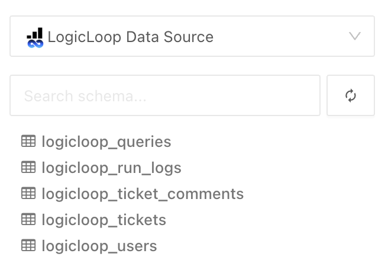

# LogicLoop Data Source

LogicLoop supports meta analytics by querying the LogicLoop Data source. You can connect to it through the **Settings > Data Sources** page.&#x20;

<figure><figcaption></figcaption></figure>

You can reference this data source when you're writing a rule. This data sources includes:

* Queries
* Run Logs
* Ticket Comments
* Tickets
* Users

<figure><figcaption></figcaption></figure>

You can use this to write meta-rules around [Case Analytics](../../beta/case-analytics.md), Queries and Users. For example, you could query which member of your team wrote which type of rule and when, seeing if rules older than a certain time should be retired, etc.&#x20;
