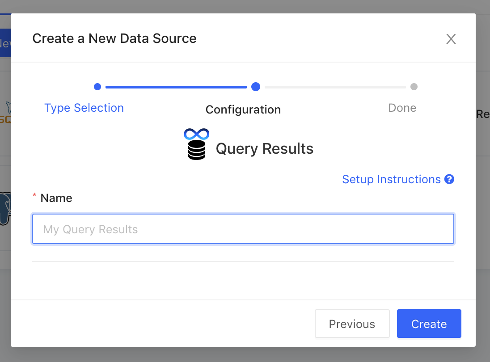

# Combine Results

LogicLoop enables you to join results from different queries and data sources. You can join results from any query, including databases, API's, and spreadsheets. Sometimes you want to do analytics on top of your rule results, or to combine data stored in separate databases. In LogicLoop, you can create rules from the results of other rules. These are called meta rules.&#x20;

LogicLoop stores the latest result from each rule’s queries in an in-memory database. You can see a video example of how to combine data from different rules [here](https://www.loom.com/share/7a5aef2dfc394cc3a4e71179ba2a6545), so you can combine your Google Sheets with a production database, or your warehouse with an API data source.\
\
Simply add **Query Results** as a new **Data Source**, and just give it a name that you’ll use from the dropdown in your rule.

Then, create a new rule and use this Query Results data source you added as the data source.&#x20;

<figure><figcaption>
Showing a new rule that uses the Query Results data source
</figcaption></figure>

You are now ready to write a rule that combines data from the output of other rules on LogicLoop. Write your rule using [SQLite](https://www.sqlite.org/index.html) query syntax. You access the results of your other rules as "tables" aliased as `query_` followed by the `query id` you can get from the rule’s URL.&#x20;

.png>)

This will re-run the query defined in that rule. If you want to speed up performance and use the last result of the query instead, you can use the alias `cached_query_xx`. You can also combine data from different sources by joining query results.&#x20;


LogicLoop cannot query rules that use parameters. You’ll see "Error running query: Failed loading results from query id xx". You can remove parameters to fix this issue.

