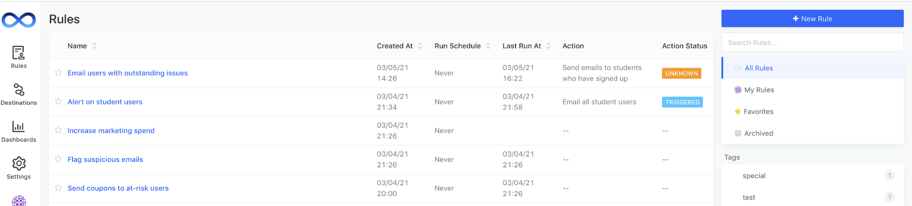
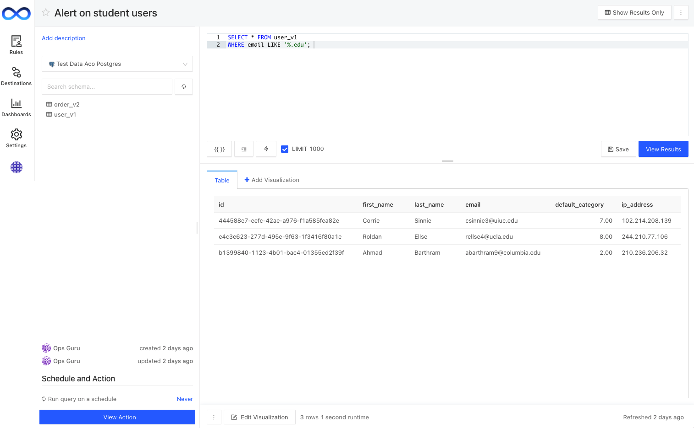

# Write a rule

LogicLoop lets you write SQL-based rules on your data to manage your business processes.&#x20;

First, navigate to the **Rules** tab on the left sidebar. Here you'll see a listing of all existing Rules with useful metadata about the status of their last runs.

Click **+ New Rule** on the top right corner to start a new query.

* Add a **Name** for your new rule in the top header.

.png>)

* Select a connected data source and search the schema. If you're using LogicLoop to query an API instead of a database, [follow these instructions instead](../../data-sources/supported-data-sources/json-apis.md).&#x20;

* Write your SQL query, click **View Results** to check it looks good, and **Save**. You can make changes and re-run to fine-tune your results.

* Publish your rule. Once you publish the rule, you will be able to [add an **Action** to it](../../actions/actions.md).&#x20;

* (Optional) Add a **Rule Description** or other helpful documentation to your rule.

* (Optional) You set a **Schedule** for your rule by clicking on **Never** in the bottom left corner. We support **Never**, **Minutes** (1-30), **Hours**, **Days**, **Weeks.**

That's it, you've written your first rule!

