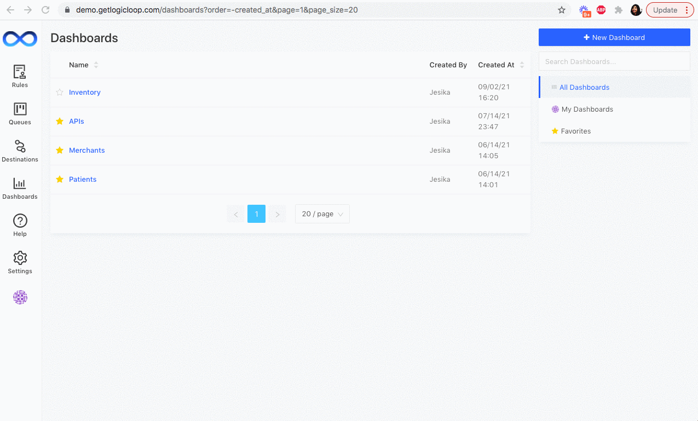
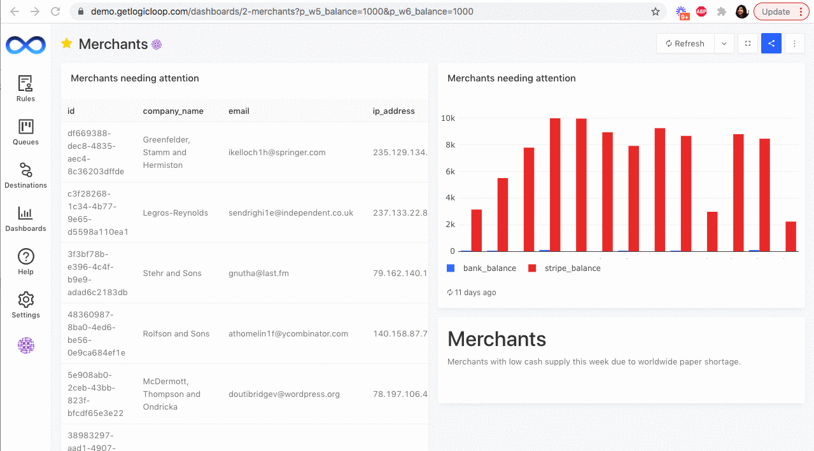

# Dashboards

## Creating a Dashboard

You can share the visualizations you create in your queries with dashboards.&#x20;

Create a new dashboard by navigating to the **Dashboards** tab and clicking **+ New Dashboard**. Now you'll be able to select the visualizations you want to include in your dashboard, and even add text notes.&#x20;

## Sharing and Embedding Dashboards

When you publish your **Dashboard**, it will be viewable by all of your teammates in LogicLoop [who have access to the underlying data source](../../teams/groups-and-permissions.md) powering your dashboard.

In addition, you can give a specific set of users on LogicLoop permissions to edit your dashboard by clicking on **Manage Permissions** and inviting them as collaborators.

If you would like to take it one step farther, you can even create a public link where anyone who has access to that link can view your dashboard. This can be useful, for example, if you want to share a dashboard with an external user who is not an employee at your company.

