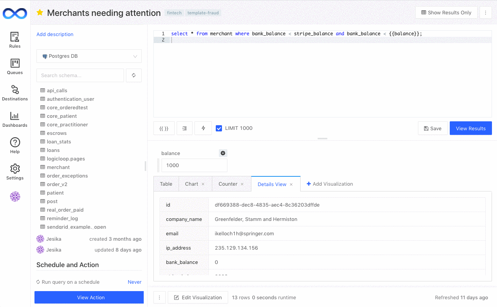
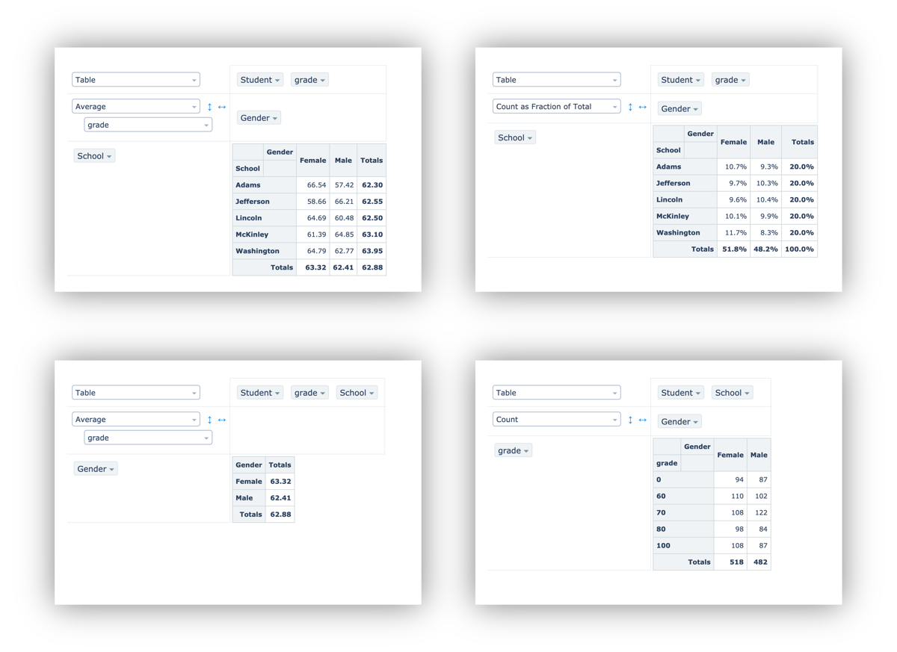

# Visualizations

## Visualizing your queries

Visualizing is often the best way to understand data. LogicLoop supports several different types of visualizations. The most popular are Charts (Line, Bar, Area, Pie, Scatter), Counters and Details views.&#x20;

To visualize your query's results, click on **+ Add Visualization** button under the query text box.&#x20;

**Charts**

.png>)

**Counters**

.png>)

**Details**

.png>)

**Pivot Tables**

All the field aliases from your query result become available at the top of the pivot control surface. You can drag these to the _row_ side or the _column_ side. You can also nest them.

<figure><figcaption></figcaption></figure>

**Map - Choropleth**

If your dataset contains names of countries or US states, you can plot them on a choropleth map.

<figure><figcaption></figcaption></figure>

**Map - Markers**

If your dataset contains latitutes and longitudes, you can plot them as markers on a map.

<figure><figcaption></figcaption></figure>
